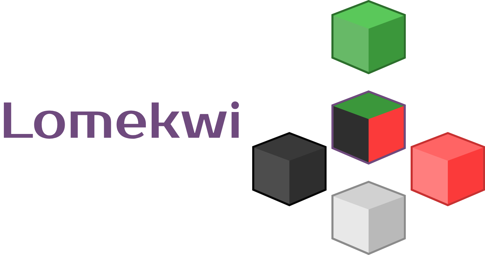

This society is divided in groups. Each member of the group has a bag of artifacts and every group has a leader. The leader is responsible for keeping the group safe, which means that it controls the artifcts of the group. A new member only enters the group if everyone accepts it. The bag of artifacts is used when a member wants to add a new item to the group. This item is then given to the leader, who breaks this item into multiple artifacts and distributes these artifacts within the group. When someone wants to get and item, it asks for it for the group leader, who collects the artifacts, mount the item and give to that member. If a leader is found dead or unreachable, the group make an election to select a new leader. Groups can share items with each other, they do that by establishing connections between group leaders. -->

Lomekwi is a distributed shared file system. It splits the files into encrypted artifacts and distribute them between the system members. This makes every member to use the same amount of disk space and keeps everything safe, since you need to mount all the artifacts of a file to decrypt it. If a file is needed the member collects all the artifacts from other members and mount the file.

You can access a small user guide in [User Guide](https://github.com/jppianta/Lomekwi/wiki/User-Guide)
